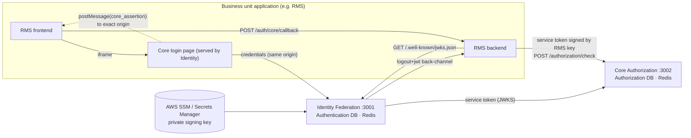
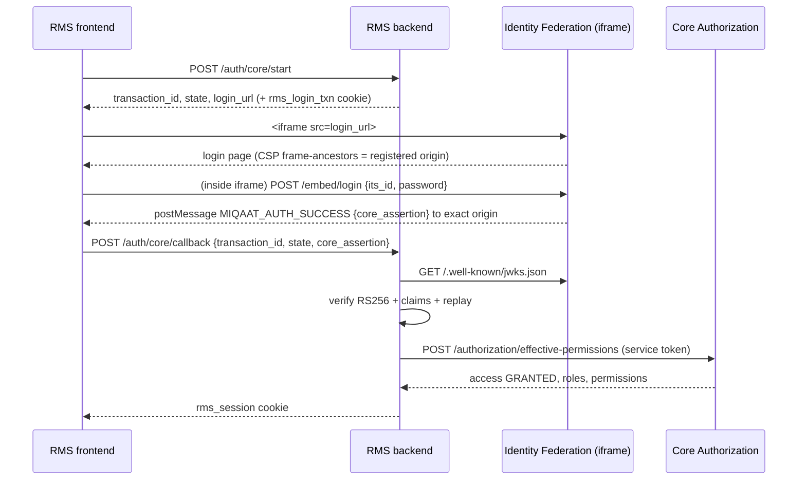

# Miqaat Identity Federation

`miqaat-identity-federation-service` is the central **embedded login federation** for the Miqaat ecosystem: RMS, AMS, VMS,
Mumin Web, the Core Portal, and any future application onboarded purely through configuration.

> **Identity Federation proves _who_ the user is. The Core Identity Authorization Service decides _what_ they may do.**

| | |
|---|---|
| Stack | NestJS 11 · Fastify 5 · PostgreSQL (Authentication DB) · Redis · `jose` (RS256) · JWKS |
| Private signing key | AWS SSM Parameter Store (`SecureString`) or AWS Secrets Manager. Never in PostgreSQL, source code, logs or any business unit |
| Companion service | [`../core-authorization`](../core-authorization): tenants, business units, utilities, roles, permissions, clients (separate DB) |
| Trust model | Every token between components is RS256 and verified through a JWKS. **There are no API keys.** |

---

## Contents

1. [How it fits together](#1-how-it-fits-together)
2. [Quick start (local)](#2-quick-start-local)
3. [Running on AWS keys (SSM / Secrets Manager)](#3-running-on-aws-keys-ssm--secrets-manager)
4. [Onboarding an application: client, embed origins, callbacks](#4-onboarding-an-application-client-embed-origins-callbacks)
5. [Embedded login: requests and responses](#5-embedded-login-requests-and-responses)
6. [Validating the assertion (BU backend)](#6-validating-the-assertion-bu-backend)
7. [Authorization: how a BU validates permissions](#7-authorization-how-a-bu-validates-permissions)
8. [Core login with workspaces (`/login`, `/select-scope`)](#8-core-login-with-workspaces-login-select-scope)
9. [SSO and logout](#9-sso-and-logout)
10. [JWKS, signing keys and service keys](#10-jwks-signing-keys-and-service-keys)
11. [API reference](#11-api-reference)
12. [Error codes](#12-error-codes)
13. [Configuration](#13-configuration)
14. [Security controls](#14-security-controls)
15. [Tests](#15-tests)
16. [Troubleshooting](#16-troubleshooting)
17. [Project structure](#17-project-structure)
18. [Further documentation](#18-further-documentation)

---

## 1. How it fits together



| Link | Token (`typ`) | Signed by | Verified through |
|---|---|---|---|
| Identity → BU app (login) | `core_assertion` (`JWT`), 60 s, single use | Identity private key | Identity `/.well-known/jwks.json` |
| BU backend → Authorization | service token (`client-authentication+jwt`), single-use `jti` | the BU backend's **own** key | the BU backend's `/.well-known/jwks.json` |
| Identity → Authorization | service token (`client-authentication+jwt`) | Identity private key | Identity JWKS |
| User / admin → Authorization APIs | access token (`at+jwt`) from `/login` / `/select-scope` | Identity private key | Identity JWKS |
| Admin → Identity (force logout, client refresh) | access token (`at+jwt`, audience = issuer) | Identity private key | Identity JWKS |
| Identity → BU back-channel logout | logout token (`logout+jwt`) | Identity private key | Identity JWKS |

What is intentionally **not** a JWT: the password (posted only to Identity and checked against scrypt), the
`federation_session` cookie (opaque HttpOnly handle stored in Redis), each app's local session cookie, and CSRF / `state` / `transaction_id`.

**Databases.** Identity owns the **Authentication DB**: `users` (`its_id` primary key, name, email, scrypt `password_hash`, status),
`auth_sessions`, `auth_session_clients`, `auth_login_attempts`, `auth_mfa_factors`, `auth_audit_events`, `signing_key_metadata`.
Every table has `created_at` and `updated_at`. Roles, permissions and clients live only in the Authorization DB. The ITS ID is the only shared key.

### 1.1 How the two repositories connect

Identity Federation (`core-authentication`) and Core Authorization (`core-authorization`) share no database or Redis. They talk
only over HTTP with RS256 tokens, so these settings must agree on both sides:

| `core-authentication/.env` | Must match in `core-authorization` | Used for |
|---|---|---|
| `AUTHZ_BASE_URL=http://localhost:3002` | `PORT=3002` (or its public URL) | Identity → Authorization calls |
| `AUTHZ_AUDIENCE=miqaat-core-authorization` | `AUTHZ_AUDIENCE` (same value) | `aud` of service tokens and user access tokens |
| `ISSUER=http://localhost:3001` | `IDENTITY_ISSUER` (same value) | `iss` of user access tokens |
| `<ISSUER>/.well-known/jwks.json` | `IDENTITY_JWKS_URI` | Authorization verifies user access tokens |
| `SERVICE_PRINCIPAL_ID=identity-federation` | `service_principals` row with the same `principal_id`, `jwks_uri` = Identity JWKS, scope `FEDERATION`, status `ACTIVE` (created by `npm run seed`) | Authorization verifies Identity's service tokens |

BU backends are registered the same way (`rms-backend`, `ams-backend`, `vms-backend`: scope `AUTHZ_CHECK`, limited to their own client IDs).

Check the link:

```bash
curl -s http://localhost:3001/health/ready     # "authorization_service":"up" only means :3002 answers /health
curl -s http://localhost:3002/health/ready
curl -s http://localhost:3001/.well-known/jwks.json | jq '.keys[].kid'
# Trust works when real calls succeed: sign in at http://localhost:3001/portal, then the Authorization log shows
# 200 on /internal/federation/*, and service_principals.last_used_at of identity-federation moves:
#   SELECT principal_id, jwks_uri, scopes, status, last_used_at FROM service_principals;
```

| Symptom | Broken link |
|---|---|
| `503 DEPENDENCY_UNAVAILABLE` on sign-in | `AUTHZ_BASE_URL` wrong, or Authorization is down |
| Authorization answers `401` on `/internal/federation/*` | principal missing or revoked, wrong `jwks_uri`, or `AUTHZ_AUDIENCE` differs |
| `401` on Authorization APIs with a fresh `/select-scope` token | `IDENTITY_ISSUER` / `IDENTITY_JWKS_URI` don't match Identity's `ISSUER`, or the token was issued with `"audience": "identity"` |

Outside local development, replace every `http://localhost:*` above with the https public URLs on both sides; production rejects
`ALLOW_INSECURE_LOCALHOST_URIS=true`.

---

## 2. Quick start (local)

Prerequisites: Node.js ≥ 22 and Docker.

> npm scripts call `node node_modules/...` directly because `.bin` shims break on Windows paths containing `&`.

| Service | URL |
|---|---|
| Identity Federation | http://localhost:3001 (Swagger `/docs`) |
| Core Authorization | http://localhost:3002 (Swagger `/docs`) |
| RMS / AMS / VMS reference apps | http://localhost:4001 · 4002 · 4003 |
| Auth Postgres · Redis · LocalStack | :5441 · :6391 · :4566 |
| Authz Postgres · Redis | :5442 · :6392 |

```bash
# 1. infrastructure
cd core-authentication && npm run infra:up
cd ../core-authorization && npm run infra:up

# 2. Authorization service
cd ../core-authorization
cp .env.example .env
npm install && npm run migration:run
npm run seed                    # tenant, 5 system roles, 14 modules + matrix, BUs, utilities, apps, 15 clients, service principals
npm run start:dev               # :3002

# 3. Identity Federation
cd ../core-authentication
cp .env.example .env            # dev values; never commit .env
npm install && npm run migration:run
npm run keys:generate           # RS256 keyset -> Secrets Manager (LocalStack locally)
npm run start:dev               # :3001

# 4. users (Authentication DB) + role assignments (Authorization DB)
npm run migrate:legacy -- --limit 50 --include 30337752   # read-only MMS; passwords re-hashed with scrypt
npm run seed:dev-users                                    # demo ITS IDs (DEV_DEMO_PASSWORD) + Non-ITS member
cd ../core-authorization && npm run seed:access

# 5. reference BU applications (separate terminals, from core-authentication)
npm run example:rms   # :4001
npm run example:ams   # :4002
npm run example:vms   # :4003
npm run example:login # :3100  separate login page (authentication + authorization JWKS)
```

Open http://localhost:4001 and sign in inside the iframe. Then open AMS and VMS; they sign you in with SSO and no password.
The Core Portal is at http://localhost:3001/portal.

### 2.1 Test embedded login locally

| Way | How | What you see |
|---|---|---|
| **Playground (your own app on :3000)** | `npm run example:playground`, open http://localhost:3000, click **Start embedded login**, sign in inside the iframe | every step on one page: transaction, postMessage, each JWKS check, claims, Authorization decision |
| **Separate login page (:3100)** | `npm run example:login`, open http://localhost:3100 | the two checks side by side: `core_assertion` verified with the **Identity JWKS**, `authorization_token` verified with the **Authorization JWKS**; session, sign out everywhere, administrator force logout. See `../README.md` |
| **Reference apps** | `npm run example:rms` (and ams / vms), open http://localhost:4001 | real BU integration: local session, protected API buttons, SSO into :4002 / :4003, federation logout |
| **Postman** | import `postman/miqaat-federation.postman_collection.json`, set `password` as a current value, run **1. Sign in** and then **3. Embedded login** top to bottom | scripts copy `transaction_id`, `csrf`, `role_id`, tokens and `login_url` into variables; raw JSON and the `core_assertion` (see [11.1](#111-postman-collections)) |
| **Automated** | `npm run smoke:federation` · `npm run test:browser` | full HTTP and real-Chromium runs |

**Using a `login_url` from Postman:** create the transaction with `"origin": "http://localhost:3000"`, then paste the returned `login_url` into the playground box (or open `http://localhost:3000/?login_url=<url-encoded login_url>`). The login form appears in the iframe and the result is verified on the page. A transaction expires after 5 minutes and works once (reopening it shows "already completed"), so create a new one for each try.

The playground uses client `rms-web-dev`. Its origin `http://localhost:3000` is seeded; on an older database add it with
`npm run client -- origins add rms-web-dev http://localhost:3000` (core-authorization). It verifies the assertion exactly as a
BU backend must (state, single-use transaction, RS256 + `kid`, JWKS signature, `iss`, `aud`, `exp`/`iat`, `txn`, `jti` replay), then calls
`/authorization/check` with the `rms-backend` service key (run `npm run example:rms` once so the key exists). Environment overrides:
`PLAYGROUND_PORT`, `PLAYGROUND_CLIENT_ID`, `PLAYGROUND_SERVICE_PRINCIPAL`, `PLAYGROUND_PERMISSION`, `IDENTITY_BASE_URL`, `AUTHZ_BASE_URL`.

> A `display=embed` login URL only renders inside an iframe on its registered origin. Opened in a browser tab it shows
> **"Open this sign-in inside the application"** with a link that loads the same login inside that application (`EMBED_CONTEXT_REQUIRED`).

---

## 3. Running on AWS keys (SSM / Secrets Manager)

The private key is loaded at startup from the configured provider and kept only in process memory. JWKS publishes the public part.

| `SIGNING_KEY_PROVIDER` | Storage | IAM needed at runtime |
|---|---|---|
| `ssm` | one `SecureString` per key under `SSM_SIGNING_KEYS_PATH/<kid>` (KMS `alias/aws/ssm` or `SIGNING_KEYS_KMS_KEY_ID`) | `ssm:GetParametersByPath` + `kms:Decrypt` on that path |
| `secretsmanager` | one secret `SECRETS_MANAGER_SIGNING_KEYS_SECRET_ID` holding the keyset | `secretsmanager:GetSecretValue` + `kms:Decrypt` on that secret |
| `file` | `SIGNING_KEYS_FILE`. **Tests only; refused when `NODE_ENV=production`** | — |

Local run against real AWS (Mumbai) without putting credentials in the project:

```bash
aws configure --profile miqaat-dev          # credentials live in ~/.aws, never in .env
# .env.aws (git-ignored): copy of .env with
#   SIGNING_KEY_PROVIDER=ssm
#   SSM_SIGNING_KEYS_PATH=/miqaat/identity/dev/signing-keys
#   AWS_PROFILE=miqaat-dev
#   AWS_REGION=ap-south-1
#   (remove AWS_ENDPOINT_URL, AWS_ACCESS_KEY_ID, AWS_SECRET_ACCESS_KEY)
ENV_FILE=.env.aws npm run keys:generate     # writes the key to AWS; prints kid/status only
ENV_FILE=.env.aws npm run keys:rotate -- status
ENV_FILE=.env.aws npm start
```

Startup log (no key material):
```json
{"context":"KeyStore","msg":"signing keyset loaded","provider":"ssm:/miqaat/identity/dev/signing-keys","active_kid":"miqaat-key-2026-09-886608"}
```

On EKS, use IRSA (no static keys). See `docs/aws-eks-deployment.md` and `docs/aws-signing-keys.md`.

---

## 4. Onboarding an application: client, embed origins, callbacks

A **client** (for example `rms-web-dev`) is registered in the Authorization service, one per application per environment.
Identity reads the client's configuration through its internal API and caches it for `CLIENT_CACHE_TTL_SECONDS` (default 30 s).

| Field | Meaning | Checked by Identity when |
|---|---|---|
| `status` | `PENDING → SECURITY_REVIEW → ACTIVE → SUSPENDED → RETIRED` | every request; only `ACTIVE` can sign in |
| `authentication_mode` | `EMBEDDED`, `REDIRECT`, `EMBEDDED_OR_REDIRECT` | `display=embed` or `page` |
| `allowed_embed_origins` | parent pages allowed to frame the login page and receive `postMessage` | `/embed/login`, `/auth/transaction`, browser `/federation/logout` |
| `callback_uris` | exact URIs for the top-level `form_post` fallback | `redirect_uri` / fallback delivery |
| `back_channel_logout_uri` | where `logout+jwt` is POSTed | federation logout |
| `post_logout_redirect_uris` | where the browser returns after logout | federation logout |

### 4.1 Get an administrator token

All client changes require a **CORE workspace holding `CONFIGURATION` edit** (Platform Administrator).

```http
POST http://localhost:3001/login
Origin: http://localhost:3001
X-CSRF-Token: <csrf from GET /portal boot JSON>
Content-Type: application/json

{ "transaction_id": "<from GET /portal>", "its_id": "30337752", "password": "********" }
```
Pick the CORE role from `session.roles` (its `role_id`, `scope_type`, `scope_id`), then:
```http
POST http://localhost:3001/select-scope
{ "transaction_id": "…", "role_id": "<Platform Administrator role_id>", "scope_type": "CORE", "scope_id": null, "audience": "authorization" }
```
`session.token` is the bearer for the Authorization API. Repeat with `"audience": "identity"` for the Identity refresh endpoint.

### 4.2 Add, list and remove embed origins

**Add**
```http
POST http://localhost:3002/clients/rms-web-dev/origins
Authorization: Bearer <CORE token, audience authorization>
Content-Type: application/json

{ "origin": "http://localhost:3000" }
```
```json
201 [
  { "origin": "http://localhost:3000", "purpose": "EMBED", "created_by": "user:30337752", "created_at": "…" },
  { "origin": "http://localhost:4001", "purpose": "EMBED", "created_by": "system", "created_at": "…" }
]
```

**List**: `GET http://localhost:3002/clients/rms-web-dev/origins`

**Remove** (query string or JSON body):
```http
DELETE http://localhost:3002/clients/rms-web-dev/origins?origin=http://localhost:3000
Authorization: Bearer <CORE token>
```
```http
DELETE http://localhost:3002/clients/rms-web-dev/origins
Authorization: Bearer <CORE token>
Content-Type: application/json

{ "origin": "http://localhost:3000" }
```
The response is `200` with the remaining origins.

**Operator CLI** (same validation and audit, run from `core-authorization` with database access):
```bash
npm run client -- origins list   rms-web-dev
npm run client -- origins add    rms-web-dev http://localhost:3000
npm run client -- origins remove rms-web-dev http://localhost:3000
npm run client -- show           rms-web-dev
```

**Origin rules**

| Input | Result |
|---|---|
| `https://rms.example.com`, `https://rms.example.com:8443`, `https://RMS.example.com/` | accepted, stored lower-case without a trailing slash |
| `http://localhost:3000`, `http://127.0.0.1:4001` | accepted only when `ALLOW_INSECURE_LOCALHOST_URIS=true` (dev; production rejects it) |
| `https://*.example.com` | `400 INVALID_ORIGIN` (no wildcards) |
| `https://rms.example.com/app`, `…?x=1`, `…#x`, `https://user:pw@…` | `400 INVALID_ORIGIN` |
| `http://rms.example.com` | `400 INVALID_ORIGIN` (https required) |
| adding an existing origin | `201`, idempotent |
| removing an origin that isn't registered | `404 ORIGIN_NOT_REGISTERED` |
| removing the **last** origin of an ACTIVE embedded client | `409 CLIENT_CONFIGURATION_INCOMPLETE` (suspend the client first) |
| BU / utility workspace | `403 CORE_SCOPE_REQUIRED`; without `CONFIGURATION`: `403 PERMISSION_DENIED` |

Audit events: `CLIENT_ORIGIN_ADDED` and `CLIENT_ORIGIN_REMOVED`, with actor `user:<its_id>` (API) or `cli:<os user>` (CLI).

### 4.3 Apply the change in Identity immediately

Creating a transaction, opening the login page and signing in always read the client's configuration fresh from the Authorization
service, so an origin, callback or status change applies to the next sign-in without any extra call. Other lookups (portal launcher,
logout) use a cache of `CLIENT_CACHE_TTL_SECONDS`; to refresh that cache at once as well:

```http
POST http://localhost:3001/federation/clients/rms-web-dev/refresh
Authorization: Bearer <CORE token, audience identity>
```
```json
200 {
  "client_id": "rms-web-dev",
  "status": "ACTIVE",
  "authentication_mode": "EMBEDDED_OR_REDIRECT",
  "allowed_embed_origins": ["http://localhost:4001", "http://localhost:3000"],
  "callback_uris": ["http://localhost:4001/auth/core/callback"],
  "back_channel_logout_uri": "http://localhost:4001/auth/core/logout",
  "post_logout_redirect_uris": ["http://localhost:4001/logout/callback"],
  "config_version": "…",
  "refreshed_at": "2026-09-13T11:30:00.000Z"
}
```
Errors: `401 UNAUTHENTICATED` (missing or invalid token), `403 SCOPE_SELECTION_REQUIRED`, `403 ADMIN_PERMISSION_DENIED` (not CORE or no CONFIGURATION edit), `400 CLIENT_NOT_FOUND`.
It is audited as `CLIENT_CONFIG_REFRESHED`.

### 4.4 Callbacks and logout URIs

```http
POST   http://localhost:3002/clients/rms-web-dev/callbacks   { "uri": "http://localhost:3000/auth/core/callback", "uri_type": "CALLBACK" }
POST   http://localhost:3002/clients/rms-web-dev/callbacks   { "uri": "http://localhost:3000/logout/callback",    "uri_type": "POST_LOGOUT_REDIRECT" }
POST   http://localhost:3002/clients/rms-web-dev/callbacks   { "uri": "http://localhost:3000/auth/core/logout",   "uri_type": "BACK_CHANNEL_LOGOUT" }
DELETE http://localhost:3002/clients/rms-web-dev/callbacks?uri=<uri>&uri_type=CALLBACK      (or JSON body { "uri", "uri_type" })
```
URIs must match exactly (no fragment or credentials; https except localhost in dev). A client has only one `BACK_CHANNEL_LOGOUT` URI;
adding another replaces it. Unknown URIs return `404 URI_NOT_REGISTERED`, and removing the last `CALLBACK` of an ACTIVE client returns `409`.
The CLI equivalent is `npm run client -- callbacks add|remove|list <client_id> <uri> --type CALLBACK`.

### 4.5 New application checklist

1. **Organisation:** BU or utility, then `POST /applications`, then application modules (`POST /modules`) and roles (`POST /roles`).
2. **Client:** `POST /clients` with origins, callbacks, back-channel and post-logout URIs. It starts in `PENDING`.
3. **Activate:** `PATCH /clients/:id {"status":"SECURITY_REVIEW"}`, then `{"status":"ACTIVE"}`.
4. **Service principal:** register the BU backend's JWKS URL with `npm run principal:register -- --id hbs-backend --jwks-uri https://hbs…/.well-known/jwks.json --scopes AUTHZ_CHECK --clients hbs-web-prod`.
5. **Grant users:** `POST /user-roles {its_id, role_id, scope_type, scope_id}`.
6. **Integrate the frontend and backend** (sections 5–7, `docs/bu-integration-guide.md`, `examples/bu-reference-app`).

Full walkthrough: `../core-authorization/docs/onboarding-new-application.md`.

### 4.6 Status: activate, suspend, deactivate

**Clients** follow a fixed lifecycle. Only `ACTIVE` clients can sign users in or pass authorization checks.

| From | Allowed next status | Meaning |
|---|---|---|
| `PENDING` | `SECURITY_REVIEW`, `RETIRED` | new client, not usable |
| `SECURITY_REVIEW` | `ACTIVE`, `PENDING`, `RETIRED` | under review |
| `ACTIVE` | `SUSPENDED`, `RETIRED` | sign-in allowed |
| `SUSPENDED` | `ACTIVE`, `RETIRED` | temporarily disabled |
| `RETIRED` | none | permanent; any further change returns `409 CLIENT_RETIRED` |

```http
PATCH http://localhost:3002/clients/rms-web-dev
Authorization: Bearer <CORE token, audience authorization>
Content-Type: application/json

{ "status": "SUSPENDED", "reason": "incident #42" }
```
Then `POST /federation/clients/rms-web-dev/refresh` ([4.3](#43-apply-the-change-in-identity-immediately)) so Identity stops sign-in at once.
Reinstate with `{ "status": "ACTIVE", "reason": "…" }`. Errors: `409 INVALID_CLIENT_STATUS_TRANSITION` (`details.allowed` lists the valid targets),
`409 CLIENT_CONFIGURATION_INCOMPLETE` (activation needs at least one callback URI and, for embedded modes, one embed origin).

**Other records** (Authorization service, bearer token of a workspace holding the listed permission):

| Record | Status values | Change with | Permission |
|---|---|---|---|
| Tenant | `active` · `inactive` | `PATCH /tenants/:tenantId { "status" }` | CORE + `BUSINESS_UNIT_MGMT` edit |
| Business unit | `active` · `inactive` | `PATCH /business-units/:buId { "status" }` | `BUSINESS_UNIT_MGMT` edit |
| Utility | `active` · `inactive` | `PATCH /utilities/:utilityId { "status" }` | `UTILITY_MGMT` edit |
| Application | `active` · `inactive` | set on `POST /applications` (no update endpoint) | CORE + `CONFIGURATION` edit |
| User | `active` · `inactive` · `suspended` | `PATCH /users/:itsId { "status" }` | `USER_MGMT` edit |
| Role | no status | revoke permissions (`POST /role-permissions` with `"action": "REVOKE"`) or assignments (`DELETE /user-roles`) | `ROLE_MGMT` / `USER_MGMT` edit |

A user who isn't `active` fails every permission check (`USER_INACTIVE`). To also end their live sign-ins, call
`POST /federation/logout { "its_id": "…" }` with an identity-audience administrator token ([section 9](#9-sso-and-logout)).

---

## 5. Embedded login: requests and responses

These samples were captured from the running stack (tokens shortened, secrets masked).



### Step 1: start (RMS frontend → RMS backend)

```http
POST http://localhost:4001/auth/core/start
Origin: http://localhost:4001
Content-Type: application/json

{ "display": "embed" }
```
```json
200  Set-Cookie: rms_login_txn=txn_…; HttpOnly; Secure; SameSite=None; Path=/auth/core; Max-Age=300
{
  "transaction_id": "txn_C6BfjesJxPz4wcQa5E5vonw6",
  "state": "gMex8oVPHAKw9MUQrCZ8KqQQZRvnOP48",
  "login_url": "http://localhost:3001/embed/login?client_id=rms-web-dev&transaction_id=txn_C6Bf…&state=gMex8…&origin=http%3A%2F%2Flocalhost%3A4001"
}
```

A backend (or any API client) may instead create the transaction on Identity. Everything is derived from the client's
**current** configuration in the Authorization service, read fresh on every call, so an origin added or removed there applies to the next transaction:
```http
POST http://localhost:3001/auth/transaction
Content-Type: application/json

{ "client_id": "rms-web-dev", "state": "postman-state-abcdefghijs5555", "origin": "http://localhost:4001", "display": "embed" }
```
```json
201 {
  "transaction_id": "txn_gkCaRfNrl4_CaYPu6lMIX6ee", "client_id": "rms-web-dev", "display": "embed",
  "state": "postman-state-abcdefghijs5555", "status": "PENDING",
  "target_origin": "http://localhost:4001", "callback_uri": null,
  "expires_at": "2026-09-14T11:21:32.583Z", "expires_in": 300,
  "login_url": "http://localhost:3001/embed/login?client_id=rms-web-dev&transaction_id=txn_gkCa…&state=postman-state-abcdefghijs5555&display=embed&origin=http%3A%2F%2Flocalhost%3A4001",
  "csrf": "<csrf>", "csrf_header": "x-csrf-token", "required_origin": "http://localhost:3001"
}
```

| Field | Rule |
|---|---|
| `origin` | the parent page's exact origin. A client may register **several** origins; send the one the page is served from and the transaction is bound to it (`target_origin`, CSP `frame-ancestors`, `postMessage` target). It may be omitted only when exactly one origin is registered. Not registered (or removed) → `403 ORIGIN_NOT_ALLOWED` |
| `display` | `embed` (default) or `page` (top level; `redirect_uri` selects one of the registered callbacks, returned as `callback_uri`) |
| `csrf`, `csrf_header`, `required_origin` | the token the login page embeds for this transaction, so API clients can call `POST /embed/login` / `/embed/continue` without parsing HTML. Returned when `TRANSACTION_API_RETURNS_CSRF` is true (default outside production; off in production unless set). The `Origin` check still applies, and a browser can only send `Origin: http://localhost:3001` from the Identity page |
| `expires_in` | `TRANSACTION_TTL_SECONDS`; the transaction is single use |
| client state | `403 CLIENT_NOT_ACTIVE` (not ACTIVE), `403 AUTHENTICATION_MODE_NOT_ALLOWED` (`embed` on a REDIRECT client), `400 CALLBACK_NOT_ALLOWED` |

Check a transaction (the CSRF token and `state` are never returned here):
```http
GET http://localhost:3001/auth/transaction/txn_gkCaRfNrl4_CaYPu6lMIX6ee?client_id=rms-web-dev
```
```json
200 { "transaction_id": "txn_gkCa…", "client_id": "rms-web-dev", "display": "embed", "status": "PENDING",
      "target_origin": "http://localhost:4001", "expires_at": "…", "expires_in": 241 }
```
`status` becomes `COMPLETED` once an assertion was issued. Unknown, expired or another client's transaction returns `400 TRANSACTION_INVALID`.

### Step 2: the iframe loads the login page

```http
GET http://localhost:3001/embed/login?client_id=rms-web-dev&transaction_id=…&state=…&origin=http://localhost:4001
```
The response is `200 text/html` with `Content-Security-Policy: default-src 'none'; script-src 'self'; … frame-ancestors http://localhost:4001`.

Boot JSON in the page (read by `public/login.js`):
```json
{ "mode": "embed", "transaction_id": "txn_C6Bf…", "csrf": "<csrf>", "client_id": "rms-web-dev", "state": "gMex8…",
  "target_origin": "http://localhost:4001", "callback_uri": null,
  "application": { "name": "RMS Web", "business_unit": "RMS", "utility": null, "environment": "DEV" },
  "session": null, "auto_continue": false }
```
Optional query parameters: `display=page` (top-level fallback), `prompt=login` (force password) or `prompt=auto` (silent SSO), `redirect_uri` (select a registered callback).

### Step 3: credentials (inside the iframe, same origin as Identity)

```http
POST http://localhost:3001/embed/login
Origin: http://localhost:3001
X-CSRF-Token: <csrf>
Content-Type: application/json

{ "transaction_id": "txn_C6Bf…", "client_id": "rms-web-dev", "identity_type": "ITS", "its_id": "30337752", "password": "********" }
```
Success uses the same login envelope as the Core Portal (section 8). `session.token` is the one-time `core_assertion`
(`token_type: "CoreAssertion"`, `audience` = the client, `expires_in` = `ASSERTION_TTL_SECONDS`) and `session.delivery` says how
the login page hands it over. `role_type`, `roles`, `active_role`, `modules` and `permissions` describe the user's Core roles for display;
they are never added to the assertion or to the postMessage:
```json
200  Set-Cookie: federation_session=…; HttpOnly; Secure; SameSite=None; Path=/; Max-Age=1800
{
  "success": true,
  "session": {
    "token": "eyJhbGciOiJSUzI1NiIs… (core_assertion)", "token_type": "CoreAssertion", "expires_in": 60, "audience": "rms-web-dev",
    "user": { "id": "30337752", "its_id": "30337752", "name": "…", "status": "ACTIVE" },
    "role_type": "MULTI",
    "active_role": null,
    "roles": [
      { "role_id": "…", "role_name": "Platform Administrator", "level": "CORE_ADMIN", "tenant_id": "CORE", "tenant_name": "Core", "scope_type": "CORE", "scope_id": null },
      { "role_id": "…", "role_name": "RMS Registration Admin", "level": "BUSINESS_UNIT_ADMIN", "tenant_id": "…", "tenant_name": "RMS", "scope_type": "BUSINESS_UNIT", "scope_id": "…" }
    ],
    "modules": [], "permissions": {}, "onboarding_required": false,
    "delivery": { "type": "MIQAAT_AUTH_SUCCESS", "transaction_id": "txn_C6Bf…", "state": "gMex8…", "delivery": "post_message", "target_origin": "http://localhost:4001" }
  },
  "request_id": "req-…", "timestamp": "2026-09-15T11:42:07.512Z", "scope": null, "error": null
}
```
With exactly one role, `role_type` is `SINGLE` and `active_role`, `modules`, `permissions` and `scope` are filled in, as in the portal.
Failure:
```json
401 { "success": false, "session": null, "request_id": "req-…", "timestamp": "…", "scope": null,
      "error": { "code": "INVALID_CREDENTIALS", "message": "Invalid ITS ID or password" } }
```
The sign-in page (embedded login and Core Portal) offers **ITS ID + password only**. The API itself is unchanged and still accepts
`"identity_type": "NON_ITS", "identifier": "<email or username>"`. SSO with an existing session: `POST /embed/continue { transaction_id, client_id }` (same envelope).

### Step 4: postMessage to the parent

```js
window.parent.postMessage(
  { type: 'MIQAAT_AUTH_SUCCESS', transaction_id, state, core_assertion },
  'http://localhost:4001', // the exact registered origin, never '*'
);
```
Other messages: `MIQAAT_AUTH_RESIZE {height}`, `MIQAAT_AUTH_ERROR {error: "TRANSACTION_EXPIRED" | "LOGIN_FAILED", code}` (also sent by the error page when a used or expired transaction is reopened in the registered frame, so restart sign-in), `MIQAAT_AUTH_TOP_LEVEL_REQUIRED` (third-party cookies blocked, so use `display=page`).

The parent accepts the message only if:
- `event.origin` is the Identity origin
- `event.source` is its own iframe
- `transaction_id` and `state` match
- the keys are exactly `core_assertion, state, transaction_id, type`

### Step 5: callback (RMS frontend → RMS backend)

```http
POST http://localhost:4001/auth/core/callback
Origin: http://localhost:4001
Cookie: rms_login_txn=txn_…
Content-Type: application/json

{ "transaction_id": "txn_C6Bf…", "state": "gMex8…", "core_assertion": "eyJ…" }
```
```json
200  Set-Cookie: rms_session=…; HttpOnly; Secure; SameSite=Lax; Max-Age=28800
{ "redirect": "/" }
```
Replaying the same callback returns `400 { "error": "LOGIN_TRANSACTION_MISMATCH" }`.

---

## 6. Validating the assertion (BU backend)

Decoded `core_assertion`:
```json
header:  { "alg": "RS256", "typ": "JWT", "kid": "miqaat-key-2026-09-886608" }
payload: { "iss": "http://localhost:3001", "sub": "30337752", "aud": "rms-web-dev",
           "sid": "sid_-IajPVFnfiF9ZfIAkzk9KVTU", "txn": "txn_C6BfjesJxPz4wcQa5E5vonw6",
           "auth_time": 1789297102, "jti": "ca19907b-…", "iat": 1789297102, "exp": 1789297162 }
```
Public keys:
```json
GET http://localhost:3001/.well-known/jwks.json
{ "keys": [ { "kty": "RSA", "kid": "miqaat-key-2026-09-886608", "use": "sig", "alg": "RS256", "n": "5tYK…", "e": "AQAB" } ] }
```

The backend must check **all** of the following, in order (reference: `examples/bu-reference-app/src/core-assertion-verifier.ts`):

| # | Check | Reject with |
|---|---|---|
| 1 | `rms_login_txn` cookie equals `transaction_id` (bound to this browser) | `LOGIN_TRANSACTION_MISMATCH` |
| 2 | transaction exists in its store; delete it (single use) | `LOGIN_TRANSACTION_EXPIRED` |
| 3 | `state` equals the stored state | `STATE_MISMATCH` |
| 4 | compact JWS; `alg` = RS256 (never `none` or HS256); `kid` present; `typ` = `JWT` | `MALFORMED` / `ALG_NOT_ALLOWED` / `KID_MISSING` / `TYP_INVALID` |
| 5 | signature verified with the JWKS key for `kid` (refetch JWKS on an unknown `kid`) | signature error |
| 6 | `iss` equals the Identity issuer; `aud` equals **this** client_id exactly | `AUDIENCE_MISMATCH` |
| 7 | `exp`, `iat` valid (≤ 5 s clock skew) and lifetime ≤ 60 s | `LIFETIME_TOO_LONG` |
| 8 | `txn` equals `transaction_id` | `TRANSACTION_MISMATCH` |
| 9 | `sid`, `sub` (ITS ID) and `auth_time` well formed | `SID_INVALID` / `SUBJECT_INVALID` / `AUTH_TIME_INVALID` |
| 10 | `jti` unseen (store it until `exp`) | `REPLAYED` |
| 11 | Authorization grants access to this application (section 7) | `ACCESS_DENIED:<reason>` |
| 12 | create the local session (store `sid` for back-channel logout) | — |

The assertion carries identity only. Never read roles or permissions from it.

### 6.1 The application's session cookie (encrypted)

The assertion itself is useless after step 12: it expires within 60 s, its `jti` is already spent and its `txn` is deleted. So the
reference app copies the **verified** claims into its own session cookie (`rms_session`, `ams_session`, …), encrypted with the
application's own key. Every value is taken at runtime from the verified assertion and that application's env file; nothing is fixed in code.

| Part | Value |
|---|---|
| Format | JWE compact, `alg: dir`, `enc: A256GCM`, `typ: session+jwt`, `kid` = fingerprint of the key |
| `core` | the verified assertion claims as issued: `iss`, `sub`, `aud`, `sid`, `jti`, `txn`, `auth_time`, `iat`, `exp` |
| `core_assertion` | the verified compact RS256 assertion, unchanged (about 1 KB; the sealed cookie stays under 4 KB and sealing fails loudly if it would not). It is already expired and its `jti` is spent, so it is kept for traceability only and is never accepted again |
| `lid` | id of the Redis session `bu:<client_id>:session:<lid>`, used as the revocation list |
| outer `iss` / `aud` | that application's `APP_ORIGIN` / `CLIENT_ID`, so an RMS cookie is refused by AMS |
| outer `exp` and cookie `Max-Age` | `SESSION_TTL_SECONDS` (default 28800), not the assertion's 60 s |
| Cookie flags | HttpOnly, Secure, SameSite=Lax, Path=/ |
| Key | `SESSION_ENC_KEY`: 32 random bytes, base64url, from the application's own secret store (required when `NODE_ENV=production`). In development it is generated once into `examples/bu-reference-app/.keys/<client_id>-session.key` (git-ignored), or `SESSION_KEY_FILE` |

On every request the backend decrypts the cookie (authentication tag, `iss`, `aud`, `exp`) and then requires the Redis session
`lid` to still exist with the same `sid`. Local logout and back-channel logout delete that Redis session, so a copied cookie stops
working at once even though it is still in the browser. `GET /api/me` returns the claims as `assertion` and the cookie expiry as
`session.expires_at`:

```json
{ "its_id": "30337752", "sid": "sid_-IajPVFnfiF9ZfIAkzk9KVTU", "client_id": "rms-web-dev",
  "assertion": { "iss": "http://localhost:3001", "sub": "30337752", "aud": "rms-web-dev", "sid": "sid_-IajPVFnfiF9ZfIAkzk9KVTU",
                 "jti": "ca19907b-…", "txn": "txn_C6BfjesJxPz4wcQa5E5vonw6", "auth_time": 1789297102, "iat": 1789297102, "exp": 1789297162 },
  "session": { "expires_at": "2026-09-14T19:38:22.000Z" }, "effective": { … } }
```

Production key: `node -e "console.log(require('crypto').randomBytes(32).toString('base64url'))"`. Changing the key ends every session
of that application; users get back in through SSO without a password while their federation session is alive.
The Identity signing key is never put in the cookie, and `GET /api/me` returns only the decoded claims, not the raw
`core_assertion`, so page scripts never see the token.

---

## 7. Authorization: how a BU validates permissions

The BU backend never trusts the browser. On every protected call it asks Core Authorization, authenticating with a
service token signed by **its own** private key. Authorization verifies that token through the BU's registered JWKS URL.

Decoded service token:
```json
header:  { "alg": "RS256", "typ": "client-authentication+jwt", "kid": "rms-backend-g0Tn__eMw7RoWrrw" }
payload: { "iss": "rms-backend", "sub": "rms-backend", "aud": "miqaat-core-authorization",
           "jti": "9886cc53-…", "iat": 1789297103, "exp": 1789297223 }
```

### Permission check

```http
POST http://localhost:3002/authorization/check
Authorization: Bearer <service token>
Content-Type: application/json

{ "its_id": "30337752", "client_id": "rms-web-dev", "module": "RMS_REGISTRATION", "permission": "RMS_REGISTRATION_DELETE" }
```

| Case | Response |
|---|---|
| allowed | `200 { "allowed": true, "its_id": "30337752", "client_id": "rms-web-dev", "permission": "RMS_REGISTRATION_DELETE" }` |
| user has no role whose scope covers the app | `200 { "allowed": false, "reason": "APPLICATION_ACCESS_DENIED" }` |
| role lacks the permission | `200 { "allowed": false, "reason": "PERMISSION_DENIED" }` |
| same service token reused | `401 { "error": "INVALID_TOKEN" }` |
| RMS backend asks about `vms-web-dev` | `403 { "error": "CLIENT_NOT_PERMITTED_FOR_PRINCIPAL" }` |

### Effective permissions (at login and for the UI)

```http
POST http://localhost:3002/authorization/effective-permissions
Authorization: Bearer <new service token>

{ "its_id": "30337752", "client_id": "rms-web-dev" }
```
```json
200 {
  "its_id": "30337752", "client_id": "rms-web-dev", "access": "GRANTED",
  "application": { "code": "rms", "name": "RMS Web" }, "environment": "DEV", "business_unit": "RMS", "utility": null,
  "roles": [ { "role_id": "eca5798a-…", "role_name": "RMS Registration Admin", "scope_type": "BUSINESS_UNIT", "scope_id": "2b6b1466-…" } ],
  "modules": [
    { "code": "RMS_REGISTRATION", "name": "RMS Registration", "permissions": ["RMS_REGISTRATION_CREATE", "RMS_REGISTRATION_DELETE", "RMS_REGISTRATION_EDIT", "RMS_REGISTRATION_VIEW"] },
    { "code": "RMS_REPORTS", "name": "RMS Reports", "permissions": ["RMS_REPORTS_VIEW"] }
  ],
  "permissions": ["RMS_REGISTRATION_CREATE", "RMS_REGISTRATION_DELETE", "RMS_REGISTRATION_EDIT", "RMS_REGISTRATION_VIEW", "RMS_REPORTS_VIEW"]
}
```

### What Authorization checks

1. **Service token:**
   - `typ` is `client-authentication+jwt` and `alg` is RS256 with a `kid`.
   - `iss` = `sub` = an ACTIVE registered principal, and the signature verifies with that principal's JWKS.
   - `aud` is `miqaat-core-authorization`, the lifetime is ≤ 300 s, and the `jti` is single use.
   - The principal holds scope `AUTHZ_CHECK` and may query this `client_id`.
2. **Decision:**
   1. The client exists and is ACTIVE; the application and its BU/utility are active.
   2. The user exists and is active.
   3. The user has an assignment whose scope covers the application owner: CORE covers everything, a BU covers itself and its utilities, a utility covers itself.
   4. The role's permissions include the requested code in this application's modules; otherwise `PERMISSION_DENIED` or `MODULE_MISMATCH`.
3. **Caching:** results are cached per `(its_id, client_id)` and invalidated immediately on any RBAC or client change. If Redis
   refuses the invalidation, the admin write returns `503 CACHE_INVALIDATION_FAILED` (change saved; cached results expire within 60 s).

The business API in the reference app enforces it per request:
```http
GET http://localhost:4001/api/demo/delete     (Cookie: rms_session=…)
200 { "allowed": true, "permission": "RMS_REGISTRATION_DELETE", "data": { "message": "RMS Web: 'delete' on RMS_REGISTRATION succeeded" } }
403 { "allowed": false, "permission": "VMS_EVENTS_CREATE", "reason": "PERMISSION_DENIED" }
```

---

## 8. Core login with workspaces (`/login`, `/select-scope`)

For the Core Portal and admin APIs (MIQAAT CORE Role & Permission Module). A person can hold several roles in several
scopes (CORE, BUSINESS_UNIT, UTILITY); each role × scope is a **workspace**.

```http
POST http://localhost:3001/login        (same as /portal/login; needs Origin + X-CSRF-Token from GET /portal)
{ "transaction_id": "…", "its_id": "31267890", "password": "********" }
```
Every response of `/login`, `/portal/login`, `/select-scope` and `/portal/select-scope` uses one envelope.
A user with **several roles** (`role_type: "MULTI"`) gets every role in `session.roles` and no active role yet:
```json
200 {
  "success": true,
  "session": {
    "token": "eyJ… (unscoped at+jwt)", "token_type": "Bearer", "expires_in": 600, "audience": "miqaat-core-authorization",
    "user": { "id": "31267890", "its_id": "31267890", "name": "Murtaza Saifuddin", "status": "ACTIVE" },
    "role_type": "MULTI",
    "active_role": null,
    "roles": [
      { "role_id": "…", "role_name": "Business Unit Admin", "level": "BUSINESS_UNIT_ADMIN", "tenant_id": "…", "tenant_name": "RMS", "scope_type": "BUSINESS_UNIT", "scope_id": "…" },
      { "role_id": "…", "role_name": "Utility Admin", "level": "UTILITY_ADMIN", "tenant_id": "…", "tenant_name": "Helpdesk", "scope_type": "UTILITY", "scope_id": "…" },
      { "role_id": "…", "role_name": "Utility Admin", "level": "UTILITY_ADMIN", "tenant_id": "…", "tenant_name": "Zone Support", "scope_type": "UTILITY", "scope_id": "…" }
    ],
    "modules": [],
    "permissions": {},
    "onboarding_required": false
  },
  "request_id": "req-…", "timestamp": "2026-09-15T11:42:07.512Z", "scope": null, "error": null
}
```
A user with **one role** (`role_type: "SINGLE"`) is activated at once — `active_role`, `modules`, `permissions`, a scoped token and `scope` are filled in:
```json
200 {
  "success": true,
  "session": {
    "token": "eyJ… (at+jwt with role_id, scope_type, scope_id)", "token_type": "Bearer", "expires_in": 600, "audience": "miqaat-core-authorization",
    "user": { "id": "30416234", "its_id": "30416234", "name": "Ali Hakim", "status": "ACTIVE" },
    "role_type": "SINGLE",
    "active_role": { "role_id": "…", "role_name": "Platform Administrator", "level": "CORE_ADMIN", "tenant_id": "CORE", "tenant_name": "Core", "scope_type": "CORE", "scope_id": null },
    "roles": [ { "role_id": "…", "role_name": "Platform Administrator", "level": "CORE_ADMIN", "tenant_id": "CORE", "tenant_name": "Core", "scope_type": "CORE", "scope_id": null } ],
    "modules": ["dashboard", "business-unit-management", "utility-management", "role-management", "user-management", "configuration"],
    "permissions": {
      "dashboard": { "create": false, "read": true, "update": false, "delete": false, "approve": false, "export": false },
      "role-management": { "create": true, "read": true, "update": true, "delete": false, "approve": false, "export": false }
    },
    "onboarding_required": false
  },
  "request_id": "req-…", "timestamp": "2026-09-15T11:42:07.512Z", "scope": "PLATFORM", "error": null
}
```

| Field | Value |
|---|---|
| `session.role_type` | `SINGLE` (one role, already active) · `MULTI` (several roles, choose with `/select-scope`) · `NONE` (no role assigned) |
| `session.roles[]` | every role the user holds; send its `role_id`, `scope_type`, `scope_id` to `/select-scope` |
| `level` | `CORE_ADMIN` · `BUSINESS_UNIT_ADMIN` · `UTILITY_ADMIN` (from the role's scope) |
| `tenant_id` / `tenant_name` | `"CORE"` / `"Core"` for a Core role, otherwise the business unit or utility id and name |
| `modules` | slugs of the modules the active role holds at least one action on (`BUSINESS_UNIT_MGMT` → `business-unit-management`) |
| `permissions` | per module `create`, `read` (view), `update` (edit), `delete`, `approve`, `export` |
| `scope` | `PLATFORM` (Core role), `BUSINESS_UNIT`, `UTILITY`; `null` until a role is active |
| `user.id` | the ITS ID (the account key) |
| `request_id` | the request's correlation id (also in the logs) |
| `onboarding_required` | always `false` in this service |

Errors on these endpoints use the same envelope and the usual HTTP status:
```json
401 { "success": false, "session": null, "request_id": "req-…", "timestamp": "…", "scope": null,
      "error": { "code": "INVALID_CREDENTIALS", "message": "Invalid ITS ID or password" } }
```

```http
POST http://localhost:3001/select-scope    (same as /portal/select-scope; also "Switch Workspace")
{ "transaction_id": "…", "role_id": "…", "scope_type": "BUSINESS_UNIT", "scope_id": "…", "audience": "authorization" }
```
The response is the same envelope for the chosen role: `session.active_role`, its `modules` and `permissions`, a token carrying
only that role's scope, and `scope`. `role_type` and `roles` still describe every role the user holds.
```json
200 { "success": true,
      "session": { "token": "eyJ… (at+jwt with role_id, scope_type, scope_id)", "token_type": "Bearer", "expires_in": 600, "audience": "miqaat-core-authorization",
                   "user": { "id": "31267890", "its_id": "31267890", "name": "Murtaza Saifuddin", "status": "ACTIVE" },
                   "role_type": "MULTI",
                   "active_role": { "role_id": "…", "role_name": "Business Unit Admin", "level": "BUSINESS_UNIT_ADMIN", "tenant_id": "…", "tenant_name": "RMS", "scope_type": "BUSINESS_UNIT", "scope_id": "…" },
                   "roles": [ … ], "modules": ["dashboard", "role-management", "…"], "permissions": { "dashboard": { "create": false, "read": true, "…": false } },
                   "onboarding_required": false },
      "request_id": "req-…", "timestamp": "…", "scope": "BUSINESS_UNIT", "error": null }
```
A workspace that isn't assigned returns `403 SCOPE_NOT_ASSIGNED`. `"audience": "identity"` issues a token for Identity's admin endpoints.

**CSRF on the portal endpoints.** `GET /portal` returns a `transaction_id` and `csrf` in its boot JSON. `/login`, `/select-scope` and
`/portal/logout` need both, plus `Origin: <ISSUER>` and, after sign-in, the `federation_session` cookie. Before sign-in the pair lives
5 minutes (`TRANSACTION_TTL_SECONDS`). A successful `/login`, or opening `/portal` with an existing session, binds the transaction to that
session (`sid`) for the session's absolute lifetime, so Switch Workspace and sign-out keep working long after 5 minutes. The same token
presented with a different session returns `403 CSRF_VALIDATION_FAILED` (`CSRF_TOKEN_MISMATCH`).

```http
GET http://localhost:3002/me/permissions       Authorization: Bearer <select-scope token>
200 { "DASHBOARD": ["view"], "ROLE_MGMT": ["view","create","edit"], "USER_MGMT": ["view","create","edit"],
      "EVENT_CONTRACT": ["view","create","approve"], "API_CONTRACT": ["view","create","approve"], "CONTRACT_LIBRARY": ["view"],
      "ACCESS_REQUEST": ["view","create","approve"], "TICKET_MGMT": ["view","create","edit"], "MONITORING": ["view"],
      "AUDIT_LOG": ["view"], "CONFIGURATION": ["view","edit"] }
```
Tokens never contain permissions. Authorization re-checks the assignment and resolves permissions on every request. An unscoped
token returns `403 SCOPE_SELECTION_REQUIRED`, and a revoked assignment returns `403 ASSIGNMENT_NOT_ACTIVE`.

Demo users: `30416234` Platform Administrator (migrated from MMS); `31189012`, `31145678`, `31267890` and `31278901` use `DEV_DEMO_PASSWORD`.

---

## 9. SSO and logout

| Flow | Request | Result |
|---|---|---|
| SSO into another app | the iframe finds `federation_session`, then the user clicks "Continue" (`POST /embed/continue`) | new assertion for that app, same `sid` |
| Silent SSO | `login_url` + `&prompt=auto` | assertion without interaction when a session exists |
| Sign out of one app | the BU deletes its local session | federation session kept |
| Sign out everywhere (browser) | top-level form `POST /federation/logout` `client_id, logout_hint=<sid>, post_logout_redirect_uri, state` from a registered origin | session revoked, `logout+jwt` POSTed to every participating app, `303` to a registered URI |
| Admin force logout | `POST /federation/logout` `Authorization: Bearer <identity-audience token>` `{ "its_id": "…" }` or `{ "sid": "…" }` | needs CORE + `USER_MGMT` edit; `{ "revoked_sessions": n, "clients_notified": [...] }` |

Back-channel logout token (`typ logout+jwt`, `aud` = client_id, `sid`, `events.http://schemas.openid.net/event/backchannel-logout`,
no `nonce`) is verified by the BU through the JWKS, which then deletes local sessions for that `sid`.

---

## 10. JWKS, signing keys and service keys

| Key | How many | Private part stored in | Public part shared through |
|---|---|---|---|
| Identity signing key | one keyset for the federation | Identity's SSM path / secret only | `GET /.well-known/jwks.json` |
| BU / utility backend service key | one per backend that calls Authorization | that backend's **own** secret store (e.g. `/miqaat/bu/rms/prod/service-key`) | the backend's `/.well-known/jwks.json`, registered as a service principal |
| Authorization service signing key | one, signs `authorization_token` (`authz+jwt`) only | `AUTHZ_SIGNING_PRIVATE_KEY` from a secret store (dev: generated into `core-authorization/.keys/authorization-signing.pem`) | Authorization `GET /.well-known/jwks.json` (`kid` `authz-…`) |

No business unit ever receives the Identity private key. A leaked BU key only lets someone act as that BU for its own clients, and the principal can be revoked.

Rotation (`NEXT → ACTIVE → RETIRING → RETIRED`, both keys published during overlap):
```bash
npm run keys:rotate -- stage      # publish NEXT in JWKS
npm run keys:rotate -- promote    # after KEY_REFRESH_INTERVAL_SECONDS + verifier cache: NEXT signs
npm run keys:rotate -- retire     # after the longest token lifetime
npm run keys:rotate -- status
```

---

## 11. API reference

Unversioned paths are the published contract; `/v1/<path>` is identical. Swagger: http://localhost:3001/docs · OpenAPI: `docs/openapi.json`.

| Method | Path | Caller | Purpose |
|---|---|---|---|
| GET | `/health`, `/health/ready` | ops | liveness / readiness (DB, Redis, keys) |
| GET | `/.well-known/jwks.json` | anyone | public signing keys |
| GET | `/.well-known/miqaat-federation` | anyone | issuer metadata (endpoints, algorithms) |
| GET | `/auth/client/:clientId` | BU frontend | public display info for a client |
| POST | `/auth/transaction` | BU backend / API client | create a login transaction from fresh client configuration: `login_url`, bound `target_origin` (one of several registered), expiry, CSRF token (configurable) |
| GET | `/auth/transaction/:transactionId?client_id=` | BU backend / API client | transaction status (`PENDING` / `COMPLETED`), bound origin, remaining lifetime; never the CSRF token |
| GET | `/embed/login` | iframe / top level | login page |
| POST | `/embed/login` | login page (same origin + CSRF) | authenticate, returns the assertion delivery |
| POST | `/embed/continue` | login page | SSO with an existing federation session |
| POST | `/embed/logout` | login page | end the central session in this browser |
| GET | `/auth/session` | Identity origin | current federation session |
| POST | `/federation/logout` | browser form or admin token | federation-wide logout + back-channel |
| POST | `/federation/clients/:clientId/refresh` | admin token (CORE + CONFIGURATION edit) | apply origin, callback or status changes immediately |
| GET | `/portal` | browser | Core Portal (sign in, Select Workspace, app launcher) |
| POST | `/login` · `/portal/login` | portal page | credentials → workspaces + token |
| POST | `/select-scope` · `/portal/select-scope` | portal page | activate or switch workspace → scoped token |
| GET | `/portal/assignments` | portal page | workspaces of the session |
| GET | `/portal/applications` | portal page | launchable applications |
| POST | `/portal/logout` | portal page | sign out of this browser or everywhere |

Authorization-service endpoints used during onboarding (`/clients/:clientId/origins`, `/callbacks`, status changes, `/authorization/check`, …)
are documented in `../core-authorization/README.md` and in sections [4](#4-onboarding-an-application-client-embed-origins-callbacks) and [7](#7-authorization-how-a-bu-validates-permissions).

### 11.1 Postman collections

| Collection | Before running | Variables filled by its scripts |
|---|---|---|
| Identity: `postman/miqaat-federation.postman_collection.json` | set `password` as a *current* value (never exported) | `transaction_id`, `csrf`, `role_id`, `scope_type`, `scope_id_json`, `access_token`, `admin_identity_access_token`, `login_url`, `embed_transaction_id`, `embed_csrf`, `core_assertion`, `sid`, `bu_state`; globals `access_token` and `identity_access_token` |
| Authorization: `../core-authorization/postman/miqaat-authorization.postman_collection.json` | sign in with the Identity collection first | uses the globals; stores `tenant_id`, `bu_id`, `utility_id`, `role_id`, `client_id` |

Run order for onboarding an application end to end:

1. Identity → **1. Sign in**: Portal page → POST /login → select-scope (authorization) → select-scope (identity).
2. Authorization → **Organisation** → **Applications** → **Roles & permissions** → **Clients** (create, origins, callbacks, SECURITY_REVIEW,
   ACTIVE, Apply in Identity) → **Users & assignments**.
3. Identity → **3. Embedded login**: Create transaction (returns the CSRF token) → Transaction status → Authenticate (saves `core_assertion`
   and `sid`, and logs the decoded claims in the Postman console).
4. Identity → **5. Business unit app (RMS reference, :4001)**: RMS start → Identity login page → Identity sign in → RMS callback →
   `GET /api/me` shows the claims stored in the encrypted `rms_session` cookie. Needs a user with an RMS role (e.g. 30337752).

Access tokens last 10 minutes: re-run the two select-scope requests when a call returns `401`. Every request logs the error body
to the Postman console when it fails.

**Saved examples.** Every request in both collections has saved example responses (request → *Examples*): Identity 107, Authorization
204, covering success, errors and edge cases (CSRF missing / wrong / wrong Origin, expired or reused transaction, wrong password, 429 lock,
role_type SINGLE / MULTI / NONE for portal and embedded login, select-scope switch, unregistered origin, SSO continue, every logout
variant, RMS callback failures, permission denials, client lifecycle transitions, origin / callback add and remove rules). Each request
description states its purpose, when to use it, what it needs and lists its saved responses; the collection description has the full
index. Examples were captured from the running stack; CORE administrator successes were captured from the isolated test database;
examples marked *(documented from the code, not captured)* need an administrator account or a failing dependency. Tokens, CSRF
tokens, cookies and passwords are redacted.

---

## 12. Error codes

Every error body is `{ "error": "<CODE>", "message": "…", "correlation_id": "…" }`. Log the `correlation_id` when reporting issues.

| HTTP | Code | Meaning / fix |
|---|---|---|
| 400 | `VALIDATION_ERROR` | body/query failed validation |
| 400 | `CLIENT_NOT_FOUND` | unknown `client_id` |
| 403 | `CLIENT_NOT_ACTIVE` | client not ACTIVE (pending, suspended or retired) |
| 403 | `AUTHENTICATION_MODE_NOT_ALLOWED` | `display` not allowed by `authentication_mode` |
| 403 | `ORIGIN_NOT_ALLOWED` | parent origin not registered: add it ([4.2](#42-add-list-and-remove-embed-origins)) and refresh ([4.3](#43-apply-the-change-in-identity-immediately)) |
| 400 | `CALLBACK_NOT_ALLOWED` | `redirect_uri` / post-logout URI not registered |
| 400 | `TRANSACTION_INVALID` | transaction expired (5 min) or unknown: start again |
| 409 | `TRANSACTION_ALREADY_USED` | transaction already completed (also when its login page is reopened); inside a registered iframe the error is shown and `MIQAAT_AUTH_ERROR` is posted to the parent |
| 403 | `CSRF_VALIDATION_FAILED` | `details.reason`: `ORIGIN_HEADER_MISMATCH` (Origin must be exactly the Identity origin: `localhost`, not `127.0.0.1`) · `CSRF_TOKEN_MISSING` · `CSRF_TOKEN_MISMATCH` (token from another page, an expired transaction, or a portal token used by a different session) |
| 401 | `INVALID_CREDENTIALS` | wrong ITS ID/password (uniform message, timing equalised) |
| 403 | `ACCOUNT_UNAVAILABLE` | user disabled or locked |
| 429 | `TOO_MANY_ATTEMPTS` | brute-force protection; see `retry_after` |
| 401 | `SESSION_REQUIRED` | no federation session for SSO / select-scope |
| 401 | `UNAUTHENTICATED` | missing or invalid bearer token |
| 403 | `SCOPE_SELECTION_REQUIRED` | token has no active workspace |
| 403 | `SCOPE_NOT_ASSIGNED` | selected workspace isn't assigned |
| 403 | `ADMIN_PERMISSION_DENIED` | not a CORE workspace with the required permission |
| 403 | `LOGOUT_HINT_MISMATCH` | `logout_hint` isn't the current session |
| 503 | `DEPENDENCY_UNAVAILABLE` | Authorization service unreachable (fails closed) |

---

## 13. Configuration

`.env` (local) or Kubernetes ConfigMap/Secret. Validated at startup with zod; values are never logged. Template: `.env.example`.

| Variable | Default | Notes |
|---|---|---|
| `ISSUER` | — | public origin of this service (`iss`); https in production |
| `PORT`, `LOG_LEVEL`, `TRUST_PROXY`, `SWAGGER_ENABLED` | 3001, info, false, true | |
| `AUTH_DB_HOST/PORT/USER/PASSWORD/NAME/SSL` | — | Authentication DB (passwords live only here) |
| `REDIS_URL` | — | sessions, transactions, rate limits, replay |
| `AUTHZ_BASE_URL`, `AUTHZ_AUDIENCE` | —, `miqaat-core-authorization` | Authorization service |
| `SERVICE_PRINCIPAL_ID`, `SERVICE_TOKEN_TTL_SECONDS` | `identity-federation`, 120 | service tokens to Authorization |
| `CLIENT_CACHE_TTL_SECONDS` | 30 | client config cache for portal and logout lookups; transaction creation, the login page and sign-in always read fresh; `0` disables it; see `/federation/clients/:id/refresh` |
| `TRANSACTION_API_RETURNS_CSRF` | unset = `true` outside production, `false` in production | `POST /auth/transaction` also returns `csrf`, `csrf_header`, `required_origin` |
| `SIGNING_KEY_PROVIDER` | `file` | `ssm` or `secretsmanager` (production requires one of them) |
| `SSM_SIGNING_KEYS_PATH` / `SECRETS_MANAGER_SIGNING_KEYS_SECRET_ID` | `/miqaat/identity/dev/signing-keys` | |
| `SIGNING_KEYS_KMS_KEY_ID`, `AWS_REGION`, `AWS_PROFILE` | —, `ap-south-1` | `AWS_ENDPOINT_URL` only for LocalStack (rejected in production) |
| `KEY_REFRESH_INTERVAL_SECONDS` | 300 | reload keyset (rotation) |
| `ASSERTION_TTL_SECONDS`, `TRANSACTION_TTL_SECONDS`, `ACCESS_TOKEN_TTL_SECONDS` | 60, 300, 600 | |
| `SESSION_IDLE_TTL_SECONDS`, `SESSION_ABSOLUTE_TTL_SECONDS` | 1800, 28800 | federation session |
| `SESSION_COOKIE_NAME`, `COOKIE_SECURE`, `COOKIE_SAMESITE`, `COOKIE_DOMAIN` | `federation_session`, true, None, — | |
| `LOGIN_MAX_FAILURES_PER_IDENTIFIER`, `LOGIN_ACCOUNT_LOCK_SECONDS`, `LOGIN_MAX_ATTEMPTS_PER_IP`, … | 5, 900, 30 | brute force |
| `PORTAL_ENVIRONMENT` | `DEV` | environment of launchable apps |
| `LEGACY_DB_*`, `LEGACY_MIGRATION_LIMIT`, `LEGACY_INCLUDE_USER_IDS` | — | `migrate:legacy` only; read-only account |
| `DEV_DEMO_PASSWORD`, `DEV_NON_ITS_USERNAME/PASSWORD` | — | dev seeding only |
| `ENV_FILE` | `.env` | alternative env file (e.g. `.env.aws`) |

---

## 14. Security controls

- **No API keys.** RS256 only; `kid`, `typ`, `iss`, `aud` and expiry enforced; single-use `jti` for assertions and service tokens.
- **Private key** lives only in SSM or Secrets Manager plus process memory; it is never logged (pino redaction + tests) and never shared.
- **Embedding:** CSP `frame-ancestors` set to the exact registered origin, postMessage to that exact origin, no inbound message listener, no inline script.
- **Login transactions** are single use, 5 minutes, bound to CSRF + `state` + origin; the BU binds them to its browser cookie.
  A portal transaction is re-bound to the signed-in session (`sid`) and lives as long as that session, so its CSRF token keeps working
  for workspace switching and sign-out but is refused for any other session.
- **Passwords:** scrypt, uniform errors, timing equalisation, per-identifier + per-IP limits, account lock; legacy hashes upgraded on login.
- **Cookies:** `federation_session` is HttpOnly, Secure, SameSite=None with an opaque handle; its hash is stored server side.
- **Fail closed:** if the Authorization service or client configuration is unavailable, sign-in is refused.
- **Client configuration:** exact origins and URIs only (no wildcards), https (localhost only in dev), lifecycle-gated, audited changes.
- **Audit:** `auth_audit_events` (login, SSO, logout, scope selection, client refresh) plus Authorization `authorization_audit_logs`.
- Checklist: `docs/security-checklist.md`.

---

## 15. Tests

| Command | What it covers |
|---|---|
| `npm test` | unit + security: origin matching, client policy, scrypt, legacy decrypt, keyset rotation, log redaction, BU verifier attacks (alg none, HS256 confusion, kid, aud, iss, exp, txn, replay, typ) |
| `npm run test:e2e` | real Postgres + Redis + LocalStack: login page validation, CSRF, assertion claims, cookies, SSO, replay, brute force, disabled users, Non-ITS, logout + back-channel, key rotation, Secrets Manager, workspaces, client refresh |
| `SMOKE_PASSWORD=… [SMOKE_DEMO_PASSWORD=…] npm run smoke:federation` | live stack over HTTP: embedded login in RMS, SSO into AMS/VMS, per-app authorization, workspaces, logout |
| `BROWSER_PASSWORD=… npm run test:browser` | real Chromium: iframe, CSP frame-ancestors, postMessage, cookies, Select Workspace, portal launch, logout |
| `cd ../core-authorization && npm run test:all` | RBAC matrix, scopes, JWKS service tokens, BU authorization, client origins/callbacks add/remove |

---

## 16. Troubleshooting

| Symptom | Cause | Fix |
|---|---|---|
| `403 ORIGIN_NOT_ALLOWED` on `/auth/transaction` or `/embed/login` | the `origin` (your app's page origin, e.g. `http://localhost:3000`) isn't in the client's `allowed_embed_origins` | `POST /clients/<id>/origins` (or `npm run client -- origins add <id> <origin>`), then start a new transaction (read fresh, no refresh needed). A client with several origins needs `origin` in every `/auth/transaction` request |
| "Open this sign-in inside the application" | a `display=embed` login URL opened directly in a tab (`EMBED_CONTEXT_REQUIRED`) | click **Open &lt;application origin&gt;** on that page (it loads the same link inside the application, e.g. the playground on :3000), start from the application, or use `display=page` |
| Error shown inside the login iframe: "already completed" / "expired" | the transaction was used or is older than 5 minutes; the parent receives `MIQAAT_AUTH_ERROR {error: "TRANSACTION_EXPIRED"}` | start a new transaction |
| Login iframe is blank; console shows `frame-ancestors` | same as above, or the page is opened from an unregistered origin | register the exact origin, including the port |
| `CSRF_VALIDATION_FAILED` · `ORIGIN_HEADER_MISMATCH` | `Origin` missing (curl, Postman without the header), a BU origin, or the page opened as `http://127.0.0.1:3001` | send `Origin: http://localhost:3001`; open the portal at the exact `ISSUER` URL |
| `CSRF_VALIDATION_FAILED` · `CSRF_TOKEN_MISSING` / `CSRF_TOKEN_MISMATCH` | no `X-CSRF-Token`, a value from another page load, the 5-minute pre-sign-in window passed, or the token belongs to another session | reload `GET /portal` (or the login page) and send its `transaction_id` + `csrf` together; in Postman re-run **Portal page** |
| Portal shows "Session expired" when switching workspace or signing out after a few minutes | Identity build from before session-bound portal CSRF | `npm run build` and restart Identity |
| `TRANSACTION_INVALID` | more than 5 minutes passed, or the transaction was already used | start a new transaction |
| BU callback `LOGIN_TRANSACTION_MISMATCH` | transaction not started by this BU backend (no `rms_login_txn` cookie), or replay | start from the BU's `/auth/core/start` |
| `400 BAD_REQUEST` on a POST without a body (e.g. `/federation/clients/:id/refresh` from Postman) | `Content-Type: application/json` sent with an empty body | remove the Content-Type header, or send `{}` |
| `AUDIENCE_MISMATCH` in the BU | verifier `clientId` differs from the client used to log in | use the same `client_id` in both places |
| Cookies like `core_access` (HS256) sent to Identity | cookies from another app on localhost | ignored; Identity uses only `federation_session` and RS256 tokens |
| `DEPENDENCY_UNAVAILABLE` | Authorization service down or service principal not registered | start `core-authorization`; check `service_principals` |
| `AccessDeniedException` at startup (AWS) | IAM lacks `ssm:GetParametersByPath` / `secretsmanager:GetSecretValue` / `kms:Decrypt` | grant them on the key path only |
| `signing key secret … not found` | keyset not generated for this provider | `npm run keys:generate` (with the same `ENV_FILE`) |

---

## 17. Project structure

```
src/
  main.ts · bootstrap.ts · app.module.ts
  config/                 zod env schema + .env / ENV_FILE loading
  common/                 constants · DomainError + filter · pino logging (redaction, correlation id) · origin/crypto utils
  core/                   audit · cache (Redis) · database (Authentication DB, migrations) · health
  modules/
    keys/                 keyset rotation, SSM / Secrets Manager / file providers, KeyStore, /.well-known
    assertions/           RS256 assertions, logout tokens, access tokens, access-token verifier
    authorization-client/ JWKS-authenticated client for the Authorization service
    credentials/          scrypt, legacy decrypt, credential verification
    rate-limit/ clients/ transactions/ sessions/ federation/ embed/ portal/
      services/           version-agnostic domain logic
      v1/                 controllers + DTOs (API_V1)
  shared/types/           cross-module types
public/                   login page (login.js, login.css) – no inline script
scripts/                  signing keys · legacy migration · dev users · OpenAPI export · live smoke test
test/                     unit/ · e2e/ · browser/
examples/bu-reference-app/  RMS / AMS / VMS reference integration (verifier, service key, local session, logout)
examples/embed-playground/  single-page local test app on :3000 (shows every embedded-login step)
docker/ · deploy/k8s/     Dockerfile, compose (Postgres, Redis, LocalStack), EKS manifests
```

Path aliases: `@config` `@common` `@core/*` `@modules/*` `@shared`. `npm run build` runs `nest build` then `tsc-alias`.
A `/v2` edge means copying `v1/` → `v2/` and registering the module; `services/` is unchanged.

---

## 18. Further documentation

- `docs/architecture.md`: components, database separation, trust boundaries
- `docs/sequence-diagrams.md`: embedded login, SSO, fallback, portal, workspaces, logout, key rotation
- `docs/bu-integration-guide.md`: postMessage contract, callback verification, local session, back-channel logout
- `docs/aws-signing-keys.md` · `docs/aws-eks-deployment.md` · `deploy/k8s/identity-federation.yaml`
- `docs/redis-key-design.md` · `docs/security-checklist.md`
- `../core-authorization/README.md` · `docs/data-model.md` · `docs/onboarding-new-application.md`
