# Architecture — Miqaat Embedded Login Federation

> **Core proves _who_. It never decides _what_.**
> Identity Federation authenticates and issues short-lived signed assertions.
> The Core Identity Authorization Service decides access. Each application owns its own session.

## Components

```mermaid
flowchart LR
  subgraph Browser
    BUFE["BU frontend<br/>(RMS · AMS · VMS · Mumin Web · …)"]
    LOGIN["Core embedded login page<br/>(iframe, identity origin)"]
    BUFE -- "iframe src=/embed/login" --> LOGIN
    LOGIN -- "postMessage → exact registered origin" --> BUFE
  end

  subgraph IDF["miqaat-identity-federation-service (NestJS + Fastify)"]
    EMBED[embed / portal]
    TXN[transactions]
    SES[federation sessions]
    CRED[credentials + rate limit]
    KEYS[keys + JWKS]
    FEDLOG[federation logout]
  end

  subgraph AZ["miqaat-core-identity-authorization-service (NestJS + Fastify)"]
    REG[client registry]
    RBAC[BU · utility · app · env · module · role · permission]
    ENGINE[authorization engine]
  end

  LOGIN -->|"POST /embed/login (same origin, CSRF)"| EMBED
  EMBED --> TXN & SES & CRED
  CRED --> AUTHNDB[("Authentication DB<br/>PostgreSQL<br/>users + scrypt hashes")]
  SES --> IDREDIS[("Redis<br/>txn · session · rate limit")]
  KEYS --> SSM["AWS Secrets Manager<br/>RS256 private keys (KMS)"]
  EMBED -->|"GET /internal/federation/clients/:id<br/>Bearer service token (FEDERATION)"| REG
  REG --> AUTHZDB[("Authorization DB<br/>PostgreSQL<br/>no credentials")]
  ENGINE --> AZREDIS[("Redis<br/>effective-permission cache")]

  BUFE -->|"POST /auth/core/callback<br/>(assertion unchanged)"| BUBE[BU backend]
  BUBE -->|"GET /.well-known/jwks.json"| KEYS
  BUBE -->|"POST /authorization/check<br/>Bearer service token (AUTHZ_CHECK, own clients only)"| ENGINE
  BUBE --> BUSESS[("BU local session<br/>rms_session / ams_session / vms_session")]
  FEDLOG -->|"POST logout_token (RS256)"| BUBE
```

## Responsibility split

| Concern | Identity Federation | Authorization Service | BU application |
|---|---|---|---|
| Passwords / hashes | ✅ Authentication DB only | ❌ never | ❌ never sees them |
| Login UI, CSRF, brute force | ✅ | | |
| Central federation session (`federation_session`) | ✅ Redis + audit rows | | |
| RS256 signing, JWKS, rotation | ✅ (private keys in Secrets Manager) | | verifies via JWKS |
| Client IDs, origins, callbacks, lifecycle | validates (reads) | ✅ owns (DB) | registers via onboarding |
| Roles, permissions, app access | ❌ never in assertions | ✅ owns + decides | enforces server-side |
| Local application session | | | ✅ owns |
| Business API authorization | ❌ not called | ✅ `/authorization/check` | ✅ calls per request (cached ≤30s) |
| Logout | central + back-channel fan-out | | local + back-channel endpoint |

## Database separation

* **Authentication DB** (`miqaat_auth`, separate PostgreSQL server/cluster): `users` (`its_id` PK, name, email, scrypt `password_hash`, status),
  `auth_mfa_factors`, `auth_sessions`, `auth_session_clients`, `auth_login_attempts`, `auth_audit_events`, `signing_key_metadata` (kid/status only).
  Every table has `created_at` and `updated_at` (trigger-maintained). Passwords exist only here.
* **Authorization DB** (`miqaat_authz`, separate server/cluster): `business_units`, `utilities`, `environments`,
  `applications`, `app_modules`, `permissions`, `roles`, `role_permissions`, `users`, `user_application_access`,
  `user_roles`, `clients`, `client_origins`, `client_redirect_uris`, `client_status_history`, `service_principals` (public JWKS URIs only),
  `authorization_audit_logs`.
* The **ITS ID** is the only shared key. Profile data flows Identity → Authorization via `POST /users/sync`
  (whitelisted DTO; any credential field is rejected). An automated test asserts no `%pass%` column exists in the Authorization DB.

## Trust boundaries

1. **Browser ↔ Identity**: the login page is the Identity origin. The BU page cannot read the iframe (same-origin policy),
   cannot drive it (no inbound `message` listener) and can only embed it if its origin is the exact `frame-ancestors` value.
2. **Identity → Browser → BU backend**: the assertion is integrity-protected (RS256), audience-bound, transaction-bound,
   60 s, single-use. The browser is a courier only.
3. **BU backend → Authorization**: single-use RS256 service token signed with the BU's own key, verified against the BU's registered JWKS; scope `AUTHZ_CHECK`, own client IDs only.
4. **Identity → Authorization**: service token signed with the federation key, verified with the Identity JWKS; scope `FEDERATION`.
5. **Identity → BU backend**: back-channel logout tokens signed with the same keys, `typ=logout+jwt`.
6. **Administrators → Core APIs**: access token (`typ=at+jwt`) issued from a signed-in Core Portal session, verified via the Identity JWKS; rights come from Core RBAC (`core-portal.*`), never from the token. No API keys or shared secrets exist between components.

## Module map

Both services share one layout: `config/` · `common/` (constants, decorators, errors, filters, logging, utils) ·
`core/` (audit, cache, database, health) · `modules/<feature>/` (`services/`, `<feature>-services.module.ts`,
`<feature>.module.ts`, `v1/` controller + module + `dto/`) · `shared/types/`. Aliases: `@config @common @core/* @modules/* @shared`.

Identity Federation `modules/`: `keys` (providers, keyset rotation, KeyStore, JWKS/discovery), `assertions`,
`authorization-client`, `clients` (registry + policy), `credentials` (scrypt hasher, legacy decrypt, verification),
`rate-limit`, `transactions`, `sessions`, `federation` (logout + back-channel), `embed` (login service, views, controller),
`portal` (application launcher).

Authorization `modules/`: `auth` (JWKS token verifier, service principals, global JwtAuthGuard), `catalog` (lookups), `business-units`, `utilities`,
`environments`, `applications`, `app-modules`, `roles`, `permissions`, `users`, `access` (user-roles, role-permissions,
user-roles, role-permissions), `authorization` (engine + cache), `clients` (registry + lifecycle), `federation`
(internal API for Identity).

See each service README for the full tree and the `/v2` extension rule.
