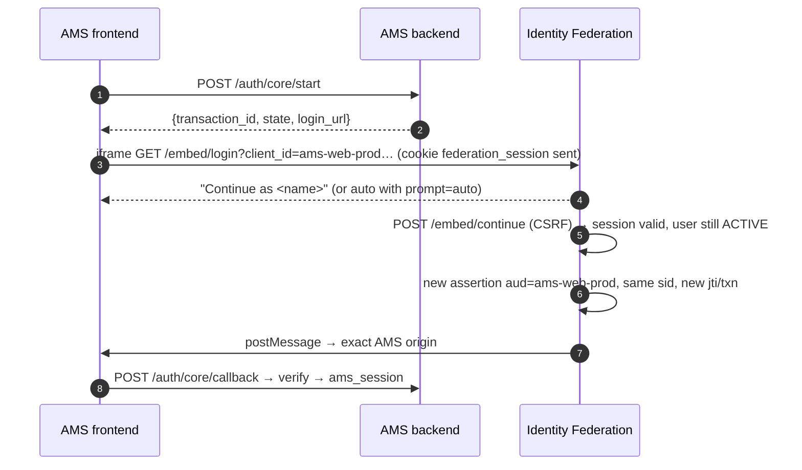
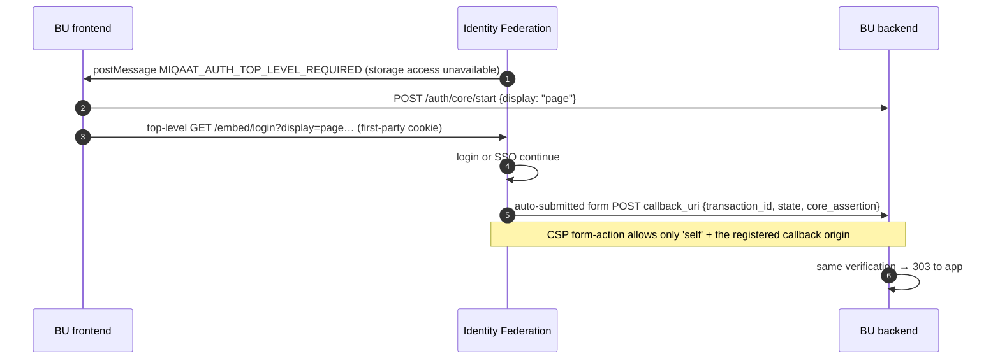
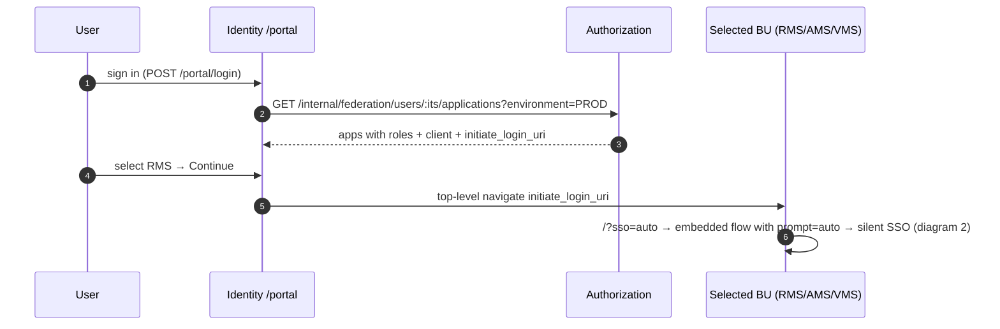
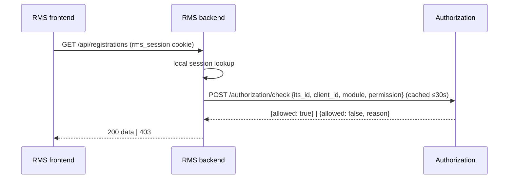
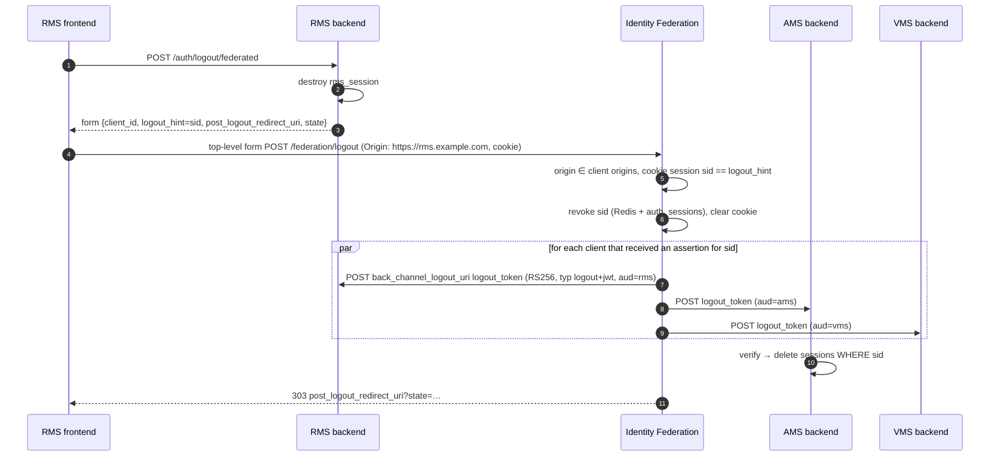

# Sequence diagrams

## 1. Embedded login (first sign-in)

```mermaid
sequenceDiagram
  autonumber
  participant U as User
  participant FE as RMS frontend (https://rms.example.com)
  participant BE as RMS backend
  participant IF as Identity Federation (iframe origin)
  participant AZ as Authorization Service
  participant R as Redis (Identity)

  U->>FE: open RMS
  FE->>BE: POST /auth/core/start
  BE->>BE: txn_id + state (Redis, 300s) + rms_login_txn cookie
  BE-->>FE: {transaction_id, state, login_url}
  FE->>IF: iframe GET /embed/login?client_id=rms-web-prod&transaction_id&state&origin
  IF->>AZ: GET /internal/federation/clients/rms-web-prod (cached 30s)
  AZ-->>IF: status, mode, allowed_embed_origins, callback_uris
  IF->>IF: ACTIVE? mode? exact origin? exact callback? fetch-metadata/referer
  IF->>R: SET federation:txn:<id> NX EX 300 (csrf, origin, state)
  IF-->>FE: login page, CSP frame-ancestors https://rms.example.com
  U->>IF: ITS ID + password (never visible to RMS)
  IF->>IF: POST /embed/login  (Origin = identity, x-csrf-token)
  IF->>R: rate limits (IP, identifier)
  IF->>IF: scrypt verify (Authentication DB), status ACTIVE
  IF->>R: create federation session (sid, handle hash)
  IF->>R: txn PENDING→COMPLETED (atomic Lua)
  IF->>IF: sign RS256 {iss, sub, aud, sid, jti, txn, auth_time, iat, exp=iat+60}
  IF-->>IF: Set-Cookie federation_session=<opaque handle>; HttpOnly; Secure; SameSite=None
  IF->>FE: postMessage({type, transaction_id, state, core_assertion}, "https://rms.example.com")
  FE->>FE: check event.origin, event.source, type, txn, state, schema
  FE->>BE: POST /auth/core/callback {transaction_id, state, core_assertion}
  BE->>BE: txn cookie == txn, GETDEL pending txn, state match
  BE->>IF: GET /.well-known/jwks.json (cached; select by kid)
  BE->>BE: RS256 + iss + aud(exact) + exp + iat + lifetime + txn + sid + jti(SET NX)
  BE->>AZ: POST /authorization/effective-permissions {its_id: sub, client_id}
  AZ-->>BE: GRANTED + roles/modules/permissions
  BE-->>FE: Set-Cookie rms_session (JWE with verified claims + core_assertion, app key) → app
```

## 2. SSO into a second application (AMS)



## 3. Third-party-cookie fallback (top-level)



## 4. Core Portal application selection



## 5. Authorization on business requests (no Identity call)



## 6. Federation logout with back-channel fan-out



Administrator-initiated: `POST /federation/logout` with `Authorization: Bearer <token from POST /select-scope, audience "identity">`
(Identity verifies it via its JWKS, then re-validates the token's workspace in Core: it must be a CORE assignment holding `USER_MGMT` edit) and `{its_id}` or `{sid}`
revokes every session of a disabled user and triggers the same fan-out.

## 6b. Core login with workspace selection

```mermaid
sequenceDiagram
  participant U as Browser (Core Portal)
  participant IF as Identity Federation
  participant AZ as Authorization
  U->>IF: POST /login {its_id, password} (CSRF + Origin)
  IF->>IF: scrypt verify against users.password_hash (Authentication DB)
  IF->>AZ: GET /internal/federation/users/{its_id}/assignments (service token)
  AZ-->>IF: [{role_id, role_name, scope_type, scope_id, scope_name}]
  IF->>IF: bind federation:txn:<id> to sid, TTL = session absolute lifetime (portal CSRF stays valid for this session only)
  IF-->>U: {its_id, name, token (unscoped), requires_scope_selection, assignments}
  U->>IF: POST /select-scope {role_id, scope_type, scope_id} (CSRF + Origin + session cookie; txn.sid must equal session sid)
  IF->>AZ: POST /internal/federation/assignments/resolve
  AZ-->>IF: {active_scope, permissions} or 404
  IF-->>U: {active_scope, token (role_id, scope_type, scope_id), permissions}
  U->>AZ: GET /me/permissions (Bearer token)
  AZ->>AZ: verify via Identity JWKS, re-check assignment, resolve role_permissions
  AZ-->>U: {MODULE_CODE: [actions]}
  Note over U,IF: Switch Workspace = POST /select-scope again (no logout)
```

## 7. Signing key rotation

```mermaid
sequenceDiagram
  participant Ops as Rotation job
  participant SSM as AWS Secrets Manager
  participant IF as Identity pods
  participant BU as BU verifiers
  Ops->>SSM: stage → new secret version with NEXT key
  IF->>SSM: reload (≤ KEY_REFRESH_INTERVAL_SECONDS)
  IF-->>BU: JWKS = {ACTIVE, NEXT}
  Note over BU: wait ≥ refresh interval + BU JWKS cache
  Ops->>SSM: promote → NEXT→ACTIVE, ACTIVE→RETIRING
  IF-->>BU: assertions now signed with new kid; JWKS = {ACTIVE, RETIRING}
  Note over BU: unknown kid triggers a JWKS refetch (cooldown 30s)
  Ops->>SSM: retire (after ≥1h) → RETIRING→RETIRED (removed from JWKS)
```
